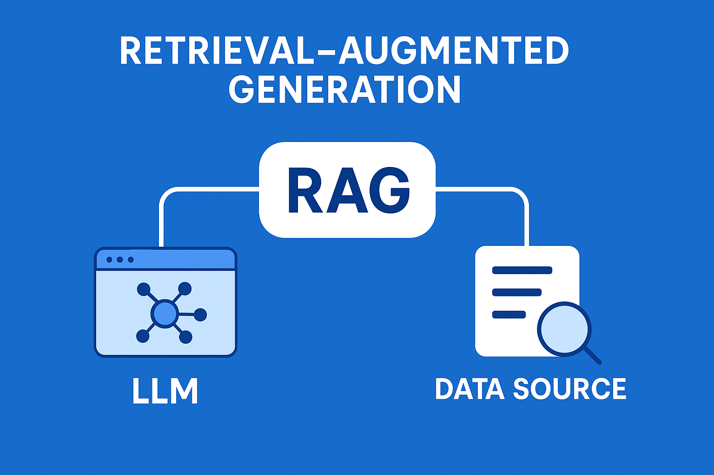

# 📘 RoT RAG Project — RAG Pipeline with FAISS + Gemini LLM + FastAPI + Cloud Run



Modern Large Language Models (LLMs) are powerful at generating text, but they rely only on the knowledge contained in their training data. This means their answers may be **outdated**, **incomplete**, or **incorrect**—especially in domains requiring specific and up-to-date information.

**Retrieval-Augmented Generation (RAG)** solves this problem by combining an LLM with external knowledge sources. The model becomes grounded with real passages retrieved from documents, producing:

✔ More accurate answers  
✔ More reliable reasoning  
✔ More contextually relevant responses  
✔ Document-based outputs  

---

## 🚀 Project Overview

This project implements a full **RAG system** with:

### 🔍 FAISS  
Used for fast semantic vector search over PDF/TXT documents.

### 🤖 Google Gemini LLM  
Generates structured English answers using retrieved context.

### ⚙️ FastAPI  
Provides a clean, production-ready REST API.

### 🐳 Docker  
Fully containerized deployment.

### ☁️ Cloud Run  
Deploy your RAG service serverlessly with Google Cloud.

---

## 📁 Project Structure

```
rot-rag-project/
│
├── data/                       
│   ├── chunks.json             
│   ├── faiss_index.bin         
│   ├── faiss_metadata.json     
│   ├── user_manual.pdf         
│   └── ...
│
├── rag/
│   ├── app.py                  
│   ├── llm_wrapper.py          
│   └── query_faiss.py          
│
├── src/
│   ├── ingest.py               
│   ├── embed_faiss.py          
│   └── eval_rag.py             
│
├── Dockerfile
├── requirements.txt
├── README.md
└── .env
```

---

# 🔧 1. Requirements

- **Python 3.11+**
- **Google Gemini API Key**
- Optional:
  - **Docker**
  - **Google Cloud SDK**

---

# 🔑 2. Create `.env`

Create a `.env` file in the project root:

```
GEMINI_API_KEY=YOUR_GEMINI_API_KEY
GEMINI_MODEL_NAME=gemini-2.5-flash
```

---

# 🧩 3. Setup Environment

```bash
python -m venv .venv
source .venv/bin/activate      # macOS/Linux
# .venv\Scripts\activate     # Windows

pip install -r requirements.txt
```

---

# 📥 4. Add Documents

Place your `.pdf` or `.txt` files inside the `data/` directory:

```
data/my_manual.pdf
```

---

# 🧱 5. Ingest Documents

```bash
python src/ingest.py
```

Generates:

```
data/chunks.json
```

---

# 🔍 6. Build FAISS Index

```bash
python src/embed_faiss.py
```

Outputs:

```
data/faiss_index.bin
data/faiss_metadata.json
```

---

# 🤖 7. Test RAG Locally

```bash
python rag/test_llm_query.py
```

What this does:

1. Runs FAISS semantic search  
2. Sends the top passages to Gemini  
3. Produces a clear English answer  

---

# 🌐 8. Start FastAPI Backend

```bash
uvicorn rag.app:app --reload
```

Then open:

- Swagger UI → http://127.0.0.1:8000/docs  
- Health check → http://127.0.0.1:8000/health  

---

# 🐳 9. Docker Usage

## Build image

```bash
docker build -t rag-app .
```

## Run container

```bash
docker run -p 8000:8000 --env-file .env rag-app
```

---

# ☁️ 10. Deploy to Google Cloud Run (Optional)

## 10.1 Create Artifact Registry

```bash
gcloud artifacts repositories create rag-repo     --repository-format=docker     --location=europe-west1
```

## 10.2 Build & Push Docker Image

```bash
gcloud builds submit     --tag europe-west1-docker.pkg.dev/rag-study-assistant/rag-repo/rag-app
```

## 10.3 Deploy to Cloud Run

```bash
gcloud run deploy rag-service     --image europe-west1-docker.pkg.dev/rag-study-assistant/rag-repo/rag-app     --platform managed     --region europe-west1     --allow-unauthenticated     --set-env-vars GEMINI_API_KEY=YOUR_KEY,GEMINI_MODEL_NAME=gemini-2.5-flash
```

Cloud Run will output a public URL such as:

```
https://rag-service-xxxxx-europe-west1.run.app
```

---

# 📌 Notes

- All answers are generated **in English**.
- Gemini is used instead of a local HuggingFace LLM.
- FAISS index is stored inside the container, requiring no external DB.
- Chunking + embedding happen **before** deployment.

---

# 📄 License

Distributed under the **MIT License**.
